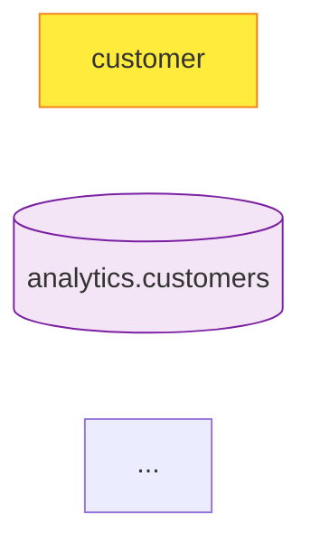

# Lineage Tracking - grai.build

## Overview

The lineage tracking module provides powerful graph analysis capabilities for understanding entity relationships, dependencies, and impact analysis in your knowledge graph projects.

## Features

- **Dependency Tracking**: Trace upstream and downstream relationships
- **Impact Analysis**: Calculate the impact of changes to entities
- **Path Finding**: Find connections between entities
- **Visualization**: Generate Mermaid and Graphviz diagrams
- **Statistics**: Analyze graph connectivity and structure
- **JSON Export**: Export lineage data for external tools

## Architecture

### Core Components

```
grai/core/lineage/
├── __init__.py           # Module exports
└── lineage_tracker.py    # Graph analysis and visualization
```

### Data Models

#### NodeType (Enum)

Represents the type of node in the lineage graph:

- `ENTITY`: A graph entity (e.g., customer, product)
- `RELATION`: A graph relation (e.g., PURCHASED)
- `SOURCE`: A data source (e.g., analytics.customers)

#### LineageNode

Represents a node in the lineage graph:

```python
@dataclass
class LineageNode:
    id: str              # Unique identifier (e.g., "entity:customer")
    name: str            # Display name
    type: NodeType       # Node type (ENTITY, RELATION, SOURCE)
    metadata: Dict       # Additional properties
```

#### LineageEdge

Represents a directed edge between nodes:

```python
@dataclass
class LineageEdge:
    from_node: str       # Source node ID
    to_node: str         # Target node ID
    relation_type: str   # Edge label (e.g., "produces", "participates_in")
```

#### LineageGraph

Container for the complete lineage graph:

```python
@dataclass
class LineageGraph:
    nodes: Dict[str, LineageNode]           # All nodes by ID
    edges: List[LineageEdge]                # All edges
    entity_to_source: Dict[str, str]        # Entity → Source mapping
    relation_to_entities: Dict[str, Tuple]  # Relation → (from, to) mapping
```

## API Reference

### Graph Construction

#### `build_lineage_graph(project: Project) -> LineageGraph`

Build a complete lineage graph from a grai.build project.

**Parameters:**

- `project`: Parsed project with entities and relations

**Returns:**

- `LineageGraph`: Complete graph with all nodes and edges

**Example:**

```python
from grai.core.parser.yaml_parser import load_project
from grai.core.lineage import build_lineage_graph

project = load_project(".")
graph = build_lineage_graph(project)
print(f"Nodes: {len(graph.nodes)}, Edges: {len(graph.edges)}")
```

**Graph Structure:**

The lineage graph captures three types of relationships:

1. **Source → Entity**: Data sources produce entities

   - Edge type: `produces`
   - Example: `analytics.customers → customer`

2. **Entity → Relation**: Entities participate in relations

   - Edge type: `participates_in`
   - Example: `customer → PURCHASED`

3. **Relation → Entity**: Relations connect to entities
   - Edge type: `connects_to`
   - Example: `PURCHASED → product`

### Entity Analysis

#### `get_entity_lineage(graph: LineageGraph, entity_name: str) -> Dict`

Get complete lineage information for an entity.

**Parameters:**

- `graph`: Lineage graph
- `entity_name`: Name of the entity

**Returns:**

```python
{
    "entity": "customer",
    "source": "analytics.customers",
    "upstream": [
        {
            "node": "analytics.customers",
            "type": "source",
            "relation": "produces"
        }
    ],
    "downstream": [
        {
            "node": "PURCHASED",
            "type": "relation",
            "relation": "participates_in"
        }
    ]
}
```

**Example:**

```python
lineage = get_entity_lineage(graph, "customer")
print(f"Source: {lineage['source']}")
print(f"Upstream: {len(lineage['upstream'])} dependencies")
print(f"Downstream: {len(lineage['downstream'])} dependents")
```

#### `find_upstream_entities(graph: LineageGraph, entity_name: str, max_depth: int = 10) -> List[str]`

Find all entities upstream of the given entity (recursive BFS).

**Parameters:**

- `graph`: Lineage graph
- `entity_name`: Starting entity
- `max_depth`: Maximum traversal depth (default: 10)

**Returns:**

- List of upstream entity names

**Example:**

```python
upstream = find_upstream_entities(graph, "product")
print(f"Product depends on: {', '.join(upstream)}")
```

#### `find_downstream_entities(graph: LineageGraph, entity_name: str, max_depth: int = 10) -> List[str]`

Find all entities downstream of the given entity (recursive BFS).

**Parameters:**

- `graph`: Lineage graph
- `entity_name`: Starting entity
- `max_depth`: Maximum traversal depth (default: 10)

**Returns:**

- List of downstream entity names

**Example:**

```python
downstream = find_downstream_entities(graph, "customer")
print(f"Customer impacts: {', '.join(downstream)}")
```

### Relation Analysis

#### `get_relation_lineage(graph: LineageGraph, relation_name: str) -> Dict`

Get complete lineage information for a relation.

**Parameters:**

- `graph`: Lineage graph
- `relation_name`: Name of the relation

**Returns:**

```python
{
    "relation": "PURCHASED",
    "from_entity": "customer",
    "to_entity": "product",
    "source": "analytics.orders",
    "upstream": [...],
    "downstream": [...]
}
```

**Example:**

```python
rel_lineage = get_relation_lineage(graph, "PURCHASED")
print(f"Connects: {rel_lineage['from_entity']} → {rel_lineage['to_entity']}")
```

### Path Finding

#### `find_entity_path(graph: LineageGraph, from_entity: str, to_entity: str) -> Optional[List[str]]`

Find the shortest path between two entities using BFS.

**Parameters:**

- `graph`: Lineage graph
- `from_entity`: Starting entity
- `to_entity`: Target entity

**Returns:**

- List of node names forming the path, or `None` if no path exists

**Example:**

```python
path = find_entity_path(graph, "customer", "product")
if path:
    print("Path: " + " → ".join(path))
else:
    print("No path found")
```

### Impact Analysis

#### `calculate_impact_analysis(graph: LineageGraph, entity_name: str) -> Dict`

Calculate the impact of changes to an entity.

**Impact Scoring:**

- **0**: No impact (no downstream dependencies)
- **1**: Low impact (1 affected item)
- **2+**: Medium impact (2-3 affected items)
- **4+**: High impact (4+ affected items)

**Parameters:**

- `graph`: Lineage graph
- `entity_name`: Entity to analyze

**Returns:**

```python
{
    "entity": "customer",
    "impact_score": 2,
    "impact_level": "low",
    "affected_entities": ["product"],
    "affected_relations": ["PURCHASED"]
}
```

**Example:**

```python
impact = calculate_impact_analysis(graph, "customer")
print(f"Impact: {impact['impact_level'].upper()}")
print(f"Score: {impact['impact_score']}")
print(f"Affects {len(impact['affected_entities'])} entities")
```

### Statistics

#### `get_lineage_statistics(graph: LineageGraph) -> Dict`

Get graph-wide statistics and metrics.

**Returns:**

```python
{
    "total_nodes": 6,
    "total_edges": 5,
    "entity_count": 2,
    "relation_count": 1,
    "source_count": 3,
    "max_downstream_connections": 1,
    "most_connected_entity": "customer"
}
```

**Example:**

```python
stats = get_lineage_statistics(graph)
print(f"Graph size: {stats['total_nodes']} nodes")
print(f"Most connected: {stats['most_connected_entity']}")
```

### Export

#### `export_lineage_to_dict(graph: LineageGraph) -> Dict`

Export lineage graph to JSON-serializable dictionary.

**Returns:**

```python
{
    "nodes": [
        {
            "id": "entity:customer",
            "name": "customer",
            "type": "entity",
            "metadata": {...}
        },
        ...
    ],
    "edges": [
        {
            "from": "entity:customer",
            "to": "relation:PURCHASED",
            "type": "participates_in"
        },
        ...
    ]
}
```

**Example:**

```python
import json

lineage_data = export_lineage_to_dict(graph)
with open("lineage.json", "w") as f:
    json.dump(lineage_data, f, indent=2)
```

### Visualization

#### `visualize_lineage_mermaid(graph: LineageGraph, focus_entity: Optional[str] = None) -> str`

Generate a Mermaid diagram for the lineage graph.

**Parameters:**

- `graph`: Lineage graph
- `focus_entity`: Optional entity to highlight

**Returns:**

- Mermaid diagram string (markdown format)

**Styling:**

- **Entities**: Light blue boxes with rounded corners
- **Relations**: Yellow diamonds
- **Sources**: Purple cylinders

**Example:**

```python
diagram = visualize_lineage_mermaid(graph, focus_entity="customer")
print(diagram)
```

**Output:**



#### `visualize_lineage_graphviz(graph: LineageGraph, focus_entity: Optional[str] = None) -> str`

Generate a Graphviz DOT diagram for the lineage graph.

**Parameters:**

- `graph`: Lineage graph
- `focus_entity`: Optional entity to highlight

**Returns:**

- Graphviz DOT string

**Styling:**

- **Entities**: Rounded boxes
- **Relations**: Octagons
- **Sources**: Cylinders
- **Layout**: Left-to-right (LR)

**Example:**

```python
dot = visualize_lineage_graphviz(graph)
with open("lineage.dot", "w") as f:
    f.write(dot)
```

**Output:**

```dot
digraph lineage {
    rankdir=LR;
    node [shape=box, style=rounded];
    entity_customer [label="customer", fillcolor="#e1f5ff", style="filled,rounded"];
    ...
}
```

## CLI Usage

The `grai lineage` command provides interactive lineage analysis.

### General Statistics

```bash
grai lineage [PROJECT_DIR]
```

**Example:**

```bash
$ grai lineage templates

Lineage Statistics
┌────────────────┬──────────┐
│ Metric         │ Value    │
├────────────────┼──────────┤
│ Total Nodes    │ 6        │
│ Total Edges    │ 5        │
│ Entities       │ 2        │
│ Relations      │ 1        │
│ Sources        │ 3        │
│ Max Downstream │ 1        │
│ Most Connected │ customer │
└────────────────┴──────────┘
```

### Entity Lineage

```bash
grai lineage --entity <name> [PROJECT_DIR]
```

**Example:**

```bash
$ grai lineage --entity customer templates

Entity Lineage: customer

Source: analytics.customers

Upstream (1):
  ← analytics.customers (source) via produces

Downstream (1):
  → PURCHASED (relation) via participates_in
```

### Relation Lineage

```bash
grai lineage --relation <name> [PROJECT_DIR]
```

**Example:**

```bash
$ grai lineage --relation PURCHASED templates

Relation Lineage: PURCHASED

Connects: customer → product
Source: analytics.orders

Upstream (2):
  ← analytics.orders (source) via produces
  ← customer (entity) via participates_in

Downstream (1):
  → product (entity) via connects_to
```

### Impact Analysis

```bash
grai lineage --impact <entity> [PROJECT_DIR]
```

**Example:**

```bash
$ grai lineage --impact customer templates

Impact Analysis: customer

Impact Score: 2
Impact Level: LOW

Affected Entities (1):
  • product

Affected Relations (1):
  • PURCHASED
```

### Visualization

Generate Mermaid diagram:

```bash
grai lineage --visualize mermaid [--output FILE] [PROJECT_DIR]
```

Generate Graphviz diagram:

```bash
grai lineage --visualize graphviz [--output FILE] [PROJECT_DIR]
```

Focus on specific entity:

```bash
grai lineage --visualize mermaid --focus customer templates
```

**Example:**

```bash
$ grai lineage --visualize mermaid --output lineage.mmd templates
✓ Wrote visualization to: lineage.mmd
```

## Use Cases

### 1. Dependency Analysis

Understand what entities and relations depend on a specific entity:

```python
# Find all dependencies
lineage = get_entity_lineage(graph, "customer")
print(f"Upstream: {lineage['upstream']}")
print(f"Downstream: {lineage['downstream']}")

# Find recursive upstream
all_upstream = find_upstream_entities(graph, "product")
print(f"Product depends on: {all_upstream}")
```

### 2. Change Impact Assessment

Before modifying an entity, assess the impact:

```python
impact = calculate_impact_analysis(graph, "customer")

if impact['impact_level'] == 'high':
    print("⚠️  High impact change - review carefully!")
    print(f"Affects {len(impact['affected_entities'])} entities")
    print(f"Affects {len(impact['affected_relations'])} relations")
```

### 3. Path Discovery

Find how entities are connected:

```python
path = find_entity_path(graph, "customer", "product")
if path:
    print("Connection: " + " → ".join(path))
else:
    print("Entities are not connected")
```

### 4. Documentation Generation

Generate lineage diagrams for documentation:

````python
# Mermaid for markdown docs
mermaid = visualize_lineage_mermaid(graph)
with open("docs/lineage.md", "w") as f:
    f.write("# Data Lineage\n\n")
    f.write("```mermaid\n")
    f.write(mermaid)
    f.write("\n```\n")

# Graphviz for high-quality PDFs
dot = visualize_lineage_graphviz(graph)
with open("lineage.dot", "w") as f:
    f.write(dot)
# Then: dot -Tpdf lineage.dot -o lineage.pdf
````

### 5. Integration with External Tools

Export lineage data for use in other tools:

```python
# Export to JSON
lineage_data = export_lineage_to_dict(graph)
with open("lineage.json", "w") as f:
    json.dump(lineage_data, f, indent=2)

# Use in data catalogs, BI tools, etc.
```

## Best Practices

### 1. Regular Lineage Analysis

Run lineage analysis regularly to understand your graph:

```bash
# Add to CI/CD pipeline
grai lineage --output lineage-report.txt
```

### 2. Impact Analysis Before Changes

Always check impact before modifying entities:

```bash
grai lineage --impact customer
```

### 3. Document Complex Graphs

For large projects, generate visualization:

```bash
grai lineage --visualize mermaid --output docs/lineage.mmd
```

### 4. Monitor Connectivity

Track graph statistics over time:

```python
stats = get_lineage_statistics(graph)
if stats['max_downstream_connections'] > 10:
    print("⚠️  Highly connected graph - consider refactoring")
```

### 5. Use Focused Visualizations

For large graphs, focus on specific areas:

```bash
grai lineage --visualize mermaid --focus customer
```

## Performance Considerations

### Graph Size

- **Small graphs** (< 100 nodes): All operations are instant
- **Medium graphs** (100-1000 nodes): BFS operations take < 100ms
- **Large graphs** (> 1000 nodes): Consider using focused analysis

### BFS Depth Limiting

For very large graphs, limit traversal depth:

```python
# Limit to 5 levels
upstream = find_upstream_entities(graph, "entity", max_depth=5)
```

### Caching

The lineage graph is built once per analysis:

```python
# Build once
graph = build_lineage_graph(project)

# Reuse for multiple analyses
lineage1 = get_entity_lineage(graph, "customer")
lineage2 = get_entity_lineage(graph, "product")
impact = calculate_impact_analysis(graph, "customer")
```

## Troubleshooting

### Entity Not Found

```
Error: Entity 'xyz' not found in lineage graph
```

**Solution:** Verify entity exists in your YAML files:

```bash
grai lineage  # Check entity list
```

### No Path Found

```python
path = find_entity_path(graph, "entity1", "entity2")
# Returns: None
```

**Reasons:**

- Entities are not connected
- Connection exists but goes through sources (path only tracks entities/relations)

### Empty Lineage

```
Upstream (0):
Downstream (0):
```

**Reasons:**

- Entity has no relations
- Relations not properly defined in YAML

## Testing

The lineage module includes comprehensive tests:

```bash
# Run lineage tests
pytest tests/test_lineage.py -v

# Check coverage
pytest tests/test_lineage.py --cov=grai.core.lineage
```

## Future Enhancements

Planned features for future versions:

1. **Circular Dependency Detection**

   - Identify cycles in the graph
   - Warn about potential issues

2. **Lineage Diff**

   - Compare lineage between versions
   - Track how dependencies change

3. **Advanced Impact Metrics**

   - Weighted impact scores
   - Criticality assessment

4. **Lineage Query Language**

   - SQL-like queries for lineage
   - Complex pattern matching

5. **Incremental Lineage**
   - Track only changed dependencies
   - Faster updates for large graphs

## Summary

The lineage tracking module provides:

- Complete dependency analysis
- Impact assessment
- Path finding
- Multiple visualization formats (Mermaid, Graphviz)
- JSON export for integration
- CLI and Python API
