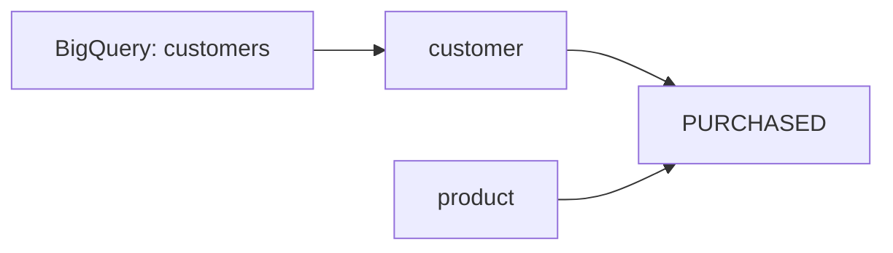
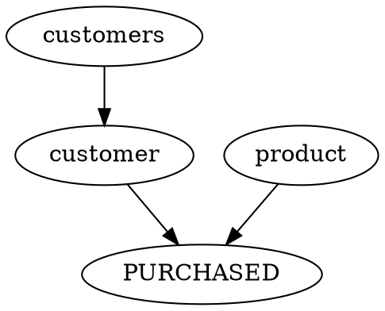

# Command Reference

Complete reference for all grai.build CLI commands.

---

## Global Options

These options work with all commands:

```bash
grai [GLOBAL_OPTIONS] COMMAND [COMMAND_OPTIONS]
```

| Option               | Description                                            |
| -------------------- | ------------------------------------------------------ |
| `--help`             | Show help message and exit                             |
| `--version`          | Show version and exit                                  |
| `--project-dir PATH` | Path to project directory (default: current directory) |
| `--debug`            | Enable debug logging                                   |

---

## Commands Overview

| Command                             | Description                     |
| ----------------------------------- | ------------------------------- |
| [`grai init`](#grai-init)           | Initialize a new project        |
| [`grai validate`](#grai-validate)   | Validate project schema         |
| [`grai build`](#grai-build)         | Compile YAML to Cypher          |
| [`grai run`](#grai-run)             | Build and execute against Neo4j |
| [`grai load`](#grai-load)           | Load data from sources          |
| [`grai docs`](#grai-docs)           | Generate documentation          |
| [`grai visualize`](#grai-visualize) | Create graph visualizations     |
| [`grai lineage`](#grai-lineage)     | Generate lineage diagrams       |
| [`grai export`](#grai-export)       | Export schema as JSON           |
| [`grai clean`](#grai-clean)         | Clean build artifacts           |

---

## `grai init`

Initialize a new grai.build project.

### Usage

```bash
grai init [OPTIONS] [PATH]
```

### Arguments

- `PATH` - Directory to initialize (default: current directory)

### Options

| Option        | Type   | Default        | Description              |
| ------------- | ------ | -------------- | ------------------------ |
| `--name TEXT` | string | directory name | Project name             |
| `--force`     | flag   | false          | Overwrite existing files |

### Examples

```bash
# Initialize in current directory
grai init

# Initialize with custom name
grai init --name my-graph-project

# Initialize in specific directory
grai init ~/projects/my-graph

# Force overwrite existing files
grai init --force
```

### Output

Creates:

```
my-project/
├── grai.yml
├── entities/
│   ├── customer.yml
│   └── product.yml
├── relations/
│   └── purchased.yml
├── data/
│   ├── customers.csv
│   ├── products.csv
│   └── purchased.csv
├── load_data.cypher
└── README.md
```

---

## `grai validate`

Validate project schema for consistency and correctness.

### Usage

```bash
grai validate [OPTIONS] [FILES...]
```

### Arguments

- `FILES` - Specific files to validate (optional, validates all if not provided)

### Options

| Option                 | Type | Default | Description                   |
| ---------------------- | ---- | ------- | ----------------------------- |
| `--strict`             | flag | false   | Enable strict validation mode |
| `--warnings-as-errors` | flag | false   | Treat warnings as errors      |

### Examples

```bash
# Validate entire project
grai validate

# Validate specific files
grai validate entities/customer.yml relations/purchased.yml

# Strict mode (more checks)
grai validate --strict

# Fail on warnings
grai validate --warnings-as-errors
```

### Validation Checks

- ✅ YAML syntax is valid
- ✅ Required fields are present
- ✅ Entity references in relations exist
- ✅ Key fields exist in properties
- ✅ Property types are valid
- ✅ No circular dependencies
- ✅ Source configurations are valid

---

## `grai build`

Compile YAML definitions to Cypher scripts.

### Usage

```bash
grai build [OPTIONS]
```

### Options

| Option              | Type   | Default        | Description                     |
| ------------------- | ------ | -------------- | ------------------------------- |
| `--output-dir PATH` | path   | `target/neo4j` | Output directory                |
| `--format TEXT`     | string | `cypher`       | Output format (cypher, gremlin) |
| `--use-cache`       | flag   | true           | Use build cache                 |
| `--clear-cache`     | flag   | false          | Clear cache before building     |
| `--no-cache`        | flag   | false          | Disable cache completely        |

### Examples

```bash
# Basic build
grai build

# Custom output directory
grai build --output-dir custom/path

# Clear cache and rebuild
grai build --clear-cache

# Force full rebuild
grai build --no-cache
```

### Output

Generates `target/neo4j/compiled.cypher` with:

```cypher
// Constraints
CREATE CONSTRAINT constraint_customer_customer_id IF NOT EXISTS
FOR (n:customer) REQUIRE n.customer_id IS UNIQUE;

// Indexes
CREATE INDEX index_customer_name IF NOT EXISTS
FOR (n:customer) ON (n.name);

// Node templates
MERGE (n:customer {customer_id: row.customer_id})
SET n.name = row.name, n.email = row.email;
```

---

## `grai run`

Build and execute Cypher against Neo4j.

### Usage

```bash
grai run [OPTIONS]
```

### Options

| Option            | Type   | Default       | Description                           |
| ----------------- | ------ | ------------- | ------------------------------------- |
| `--uri TEXT`      | string | from grai.yml | Neo4j connection URI                  |
| `--user TEXT`     | string | from grai.yml | Neo4j username                        |
| `--password TEXT` | string | from grai.yml | Neo4j password                        |
| `--database TEXT` | string | from grai.yml | Neo4j database name                   |
| `--dry-run`       | flag   | false         | Show what would be executed           |
| `--execute`       | flag   | false         | Execute immediately (no confirmation) |

### Examples

```bash
# Run with config from grai.yml
grai run

# Override connection details
grai run --uri bolt://prod:7687 --user neo4j --password secret

# Dry run (show Cypher without executing)
grai run --dry-run

# Execute without confirmation
grai run --execute --password secret
```

### Workflow

1. Validates project (`grai validate`)
2. Builds Cypher (`grai build`)
3. Connects to Neo4j
4. Executes statements
5. Reports results

---

## `grai load`

Load data from configured sources into Neo4j.

### Usage

```bash
grai load [OPTIONS] [ENTITIES...]
```

### Arguments

- `ENTITIES` - Specific entities to load (optional, loads all if not provided)

### Options

| Option                 | Type   | Default       | Description                  |
| ---------------------- | ------ | ------------- | ---------------------------- |
| `--uri TEXT`           | string | from grai.yml | Neo4j connection URI         |
| `--user TEXT`          | string | from grai.yml | Neo4j username               |
| `--password TEXT`      | string | from grai.yml | Neo4j password               |
| `--database TEXT`      | string | from grai.yml | Neo4j database name          |
| `--limit INTEGER`      | int    | none          | Limit rows per entity        |
| `--batch-size INTEGER` | int    | 1000          | Batch size for loading       |
| `--verbose` `-v`       | flag   | false         | Show detailed execution info |
| `--dry-run`            | flag   | false         | Preview without loading      |

### Examples

```bash
# Load all entities
grai load

# Load specific entities
grai load customers products

# Load with limit for testing
grai load --limit 100

# Verbose mode (show detailed progress)
grai load --verbose

# Custom batch size
grai load --batch-size 5000

# Preview data loading
grai load --dry-run --verbose
```

### Verbose Output

When using `--verbose`, you'll see:

```
[Entity: customers]
  Source: my_dataset.customers
  Batch size: 1000
  Limit: None

[Batch 1] Extracted 1000 rows
  Sample row: {'customer_id': 'C001', 'name': 'Alice'}
  Generated Cypher: MERGE (n:customer {customer_id: $customer_id})...
  ✅ Executed successfully
  Nodes created: 1000
  Properties set: 3000
```

---

## `grai docs`

Generate HTML documentation (like dbt docs).

### Usage

```bash
grai docs [OPTIONS]
```

### Options

| Option           | Type | Default       | Description                         |
| ---------------- | ---- | ------------- | ----------------------------------- |
| `--output PATH`  | path | `target/docs` | Output directory                    |
| `--serve`        | flag | false         | Serve docs locally after generating |
| `--port INTEGER` | int  | 8000          | Port for local server               |

### Examples

```bash
# Generate docs
grai docs

# Generate and serve
grai docs --serve

# Custom output directory
grai docs --output ./my-docs

# Custom port
grai docs --serve --port 8080
```

### Generated Documentation

Includes:

- 📊 Project overview with statistics
- 📦 Entity catalog with properties
- 🔗 Relation catalog with mappings
- 🕸️ Interactive graph visualization (D3.js)
- 🔄 Lineage diagrams (Mermaid.js)

Access at: `http://localhost:8000`

---

## `grai visualize`

Create interactive graph visualizations.

### Usage

```bash
grai visualize [OPTIONS]
```

### Options

| Option          | Type   | Default | Description                                  |
| --------------- | ------ | ------- | -------------------------------------------- |
| `--format TEXT` | string | `d3`    | Visualization format (d3, cytoscape, custom) |
| `--output PATH` | path   | auto    | Output file path                             |
| `--open`        | flag   | false   | Open in browser after generating             |

### Examples

```bash
# D3.js force-directed graph
grai visualize --format d3 --open

# Cytoscape.js network
grai visualize --format cytoscape

# Custom output path
grai visualize --format d3 --output viz/graph.html
```

### Formats

| Format      | Description                | Interactive |
| ----------- | -------------------------- | ----------- |
| `d3`        | D3.js force-directed graph | ✅          |
| `cytoscape` | Cytoscape.js network       | ✅          |
| `custom`    | Custom HTML template       | ✅          |

---

## `grai lineage`

Generate lineage diagrams showing data flow.

### Usage

```bash
grai lineage [OPTIONS]
```

### Options

| Option             | Type   | Default   | Description                        |
| ------------------ | ------ | --------- | ---------------------------------- |
| `--format TEXT`    | string | `mermaid` | Output format (mermaid, dot, json) |
| `--output PATH`    | path   | auto      | Output file path                   |
| `--direction TEXT` | string | `LR`      | Graph direction (LR, TB, RL, BT)   |

### Examples

```bash
# Mermaid diagram (Markdown-compatible)
grai lineage --format mermaid

# Graphviz DOT format
grai lineage --format dot

# Top-to-bottom layout
grai lineage --direction TB

# Custom output
grai lineage --format mermaid --output docs/lineage.mmd
```

### Output Formats

**Mermaid:**



**Graphviz DOT:**



---

## `grai export`

Export schema as structured data.

### Usage

```bash
grai export [OPTIONS]
```

### Options

| Option          | Type   | Default | Description                |
| --------------- | ------ | ------- | -------------------------- |
| `--format TEXT` | string | `json`  | Export format (json, yaml) |
| `--output PATH` | path   | stdout  | Output file path           |
| `--pretty`      | flag   | false   | Pretty-print output        |

### Examples

```bash
# Export to JSON (stdout)
grai export --format json

# Export to file
grai export --format json --output schema.json

# Pretty-printed JSON
grai export --format json --pretty --output schema.json

# Export as YAML
grai export --format yaml --output schema.yml
```

### JSON Schema

```json
{
  "name": "my-project",
  "version": "1.0.0",
  "entities": [
    {
      "name": "customer",
      "source": "analytics.customers",
      "keys": ["customer_id"],
      "properties": [...]
    }
  ],
  "relations": [...]
}
```

---

## `grai clean`

Clean build artifacts and cache.

### Usage

```bash
grai clean [OPTIONS]
```

### Options

| Option    | Type | Default | Description                     |
| --------- | ---- | ------- | ------------------------------- |
| `--cache` | flag | false   | Clean cache only                |
| `--all`   | flag | false   | Clean everything including docs |

### Examples

```bash
# Clean build output
grai clean

# Clean cache only
grai clean --cache

# Clean everything
grai clean --all
```

### Removes

- `target/neo4j/` - Compiled Cypher
- `target/.cache/` - Build cache
- `target/docs/` - Generated documentation (with `--all`)
- `target/visualizations/` - Visualizations (with `--all`)

---

## Environment Variables

| Variable           | Description          | Default           |
| ------------------ | -------------------- | ----------------- |
| `GRAI_PROJECT_DIR` | Project directory    | current directory |
| `NEO4J_URI`        | Neo4j connection URI | from grai.yml     |
| `NEO4J_USER`       | Neo4j username       | from grai.yml     |
| `NEO4J_PASSWORD`   | Neo4j password       | from grai.yml     |
| `NEO4J_DATABASE`   | Neo4j database name  | from grai.yml     |

### Example

```bash
export NEO4J_PASSWORD=secret
grai run  # Uses password from environment
```

---

## Exit Codes

| Code | Meaning             |
| ---- | ------------------- |
| 0    | Success             |
| 1    | Validation error    |
| 2    | Build error         |
| 3    | Connection error    |
| 4    | Execution error     |
| 5    | Configuration error |

---

## See Also

- [Getting Started](../getting-started.md) - Tutorial and examples
- [YAML Schema Reference](yaml-schema.md) - Entity and relation definitions
- [Troubleshooting](../troubleshooting.md) - Common issues
